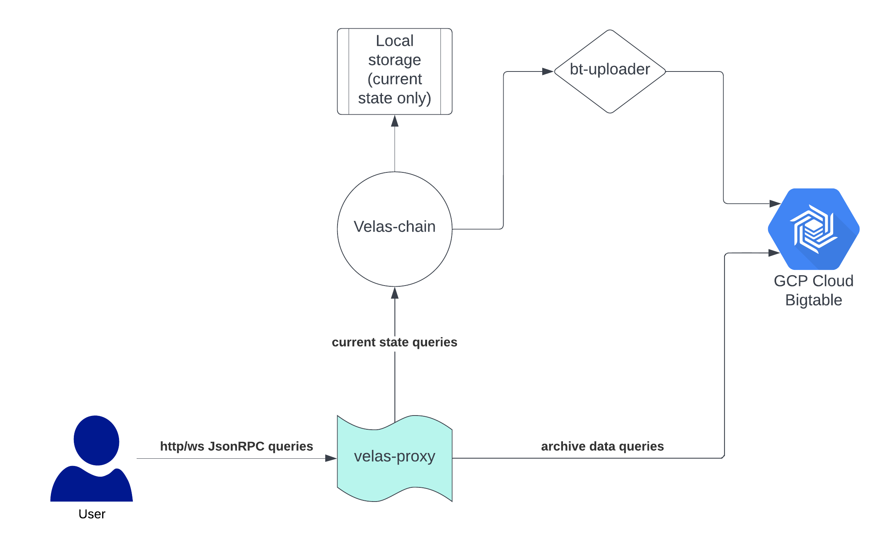

# VELAS proxy server
This project is used to read and proxy requests.

velas-proxy allows you to access historical velas-chain data in GCP BigTable.
Queries to current data are transparently proxied in JsonRPC endpoint with the Velas node.

## Configuration

This project is using `google-application-credentials.json`

This file is needed to connect project to Google Big Table.
To set up it for project you should add path to `google-application-credentials.json` to `.env` file in `GOOGLE_APPLICATION_CREDENTIALS` field.
In case file is located in project directory you can use `./google-application-credentials.json`. In case file is located somewhere outside
of project directory you should use full path to file

Please define correct `USE_SSL` property in `.env` file. `use` or `no` supported. `no` by default

Also `PERIOD` is need to define in .env file. 14 days by default.

## Deploy locally

    npm install
    npm start

It will be available on [http://localhost:9000](http://localhost:9000)

## Deploy with docker

In the project directory, you need to run:

    docker build -t velas-proxy ./
    docker run -p 127.0.0.1:9000:9000 velas-proxy

It will be available on [http://localhost:9000](http://localhost:9000)

> NOTE: for Docker build you need to set up google-application-credentials.json in project. See above

> NOTE: To run server over https please define correct path to key.pem and cert.pem files in constants.js file in root folder of the project